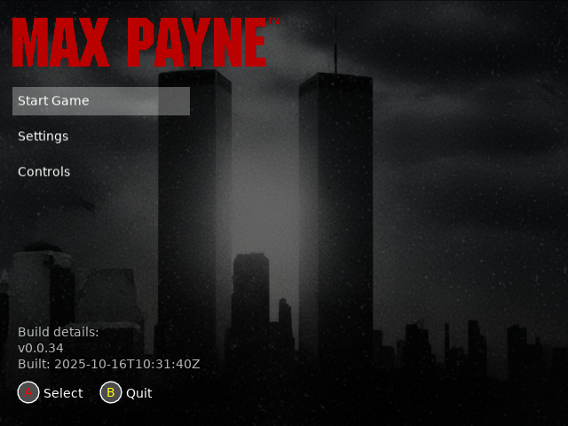
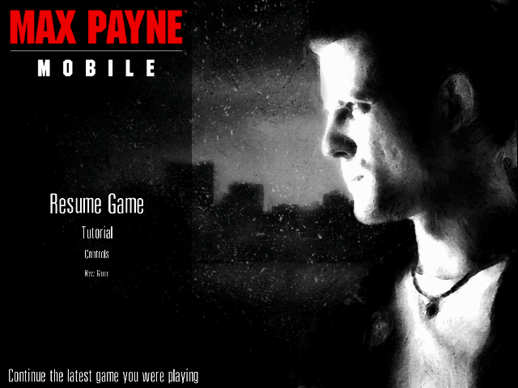
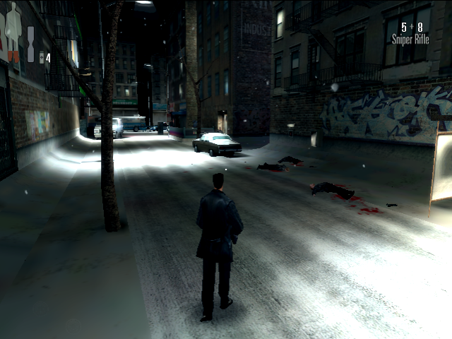
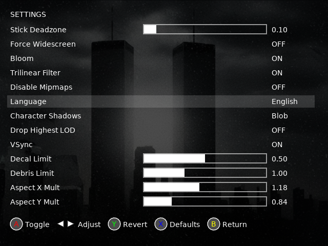

# Max Payne for Linux Handhelds

Port of Max Payne for various Linux handheld devices.


|   |   |
|---|---|
||  |
|| |


## Installing

1. Install Max Payne for ARM64 through PortMaster.
2. Install the game (Max Payne Mobile 1.7 or newer so that it includes Arm64 libs) on your Android device from Google Play or other legit source.
3. Retrieve the APK and OBB files from your Android device. You can use a apk extractor app or connect your device to a computer and copy the files directly. Many ways to achieve this so just google it.
4. Copy the APK and OBB files over to the console (SD card or over SSH). Place them in the `/roms/ports/maxpayne/` directory.
5. Launch Max Payne from the Ports menu. The first time you launch the game, it will unpack the APK and OBB files. This may take a few minutes.
6. After unpacking, the game will start loading. Enjoy playing Max Payne on your device!

## Controls

| Button            | Description      |
|-------------------|------------------|
| A                 | Jump             |
| B                 | Crouch           |
| X                 | Reload           |
| Y                 | Use/Zoom         |
| L1                | Bullet time      |
| R1                | Shoot            |
| L2                | Previous Weapon  |
| R2                | Next Weapon      |
| D-Up              | Pain Killer      |
| D-Down            | Reload           |
| D-Left            | Previous Weapon  |
| D-Right           | Next Weapon      |
| Select+R1         | Quicksave        |
| Start             | Menu             |
| Left Stick        | Move             |
| Right Stick.      | Look/Aim         |
| Select+UP/DOWN    | Adjust Camera Y  |
| Select+LEFT/RIGHT | Adjust Camera X  |


## Configuration



Once you've started the game a conf/config.txt will be created in the `/roms/ports/maxpayne/` directory. You can edit this file to change various settings:

```
use_bloom 1
trilinear_filter 1
disable_mipmaps 0
language 0 // 0 - English; 1 - French; 2 - Spanish; 3 - Italian; 4 - Russian; 5 - Japanese; 6 - German
crouch_toggle 1
character_shadows 1 // 1 - one blob; 2 - foot shadows
drop_highest_lod 0
show_weapon_menu 0
vsync_enabled 1
decal_limit 0.5
debris_limit 1
force_widescreen 0
stick_deadzone 0.1
aspect_ratio_x_mult 1.18
aspect_ratio_y_mult 0.84
```

Note some settings can be changed in-game. See the Controls section above.

## Known Issues
- Changing shooting from R1 to anything else will cause shooting to not work. This is due to a small hack in the input system to make R1 work as shoot button. Changing other buttons is however possible. 

## Building
1. $ cmake .
2. make archive
3. See archive in `archive/` folder.

Alternatively, you can use the provided `./scripts/build_with_docker.sh` (run from root of the repo) script to build the project inside a Docker container. This script will handle all the necessary steps and dependencies for you.

## Credits

This port is largely based on the work of fgsfdsfgs and Andy Nguyen who ported the game to [PSVita](https://github.com/fgsfdsfgs/max_vita) and [Nintendo Switch](https://github.com/fgsfdsfgs/max_nx) so lots of credit needs to go there.

Special thanks to [Dia2809](https://github.com/Dia2809) for contributing a fix to the framebuffer fallback so that the port works on CFWs without DRM+GDM and otherwise helping me out on the [PortMaster](https://portmaster.games/) packing of the port.

## License
This project is licensed under the MIT License. See the [LICENSE](LICENSE) file for details

## Legal

This project has no direct affiliation with Take-Two Interactive Software, Inc., Rockstar Games, Inc. or Remedy Entertainment Oyj and/or the "Max Payne" brand. "Max Payne" is a Take-Two Interactive Software, Inc. brand. All Rights Reserved.

No assets or program code from the original game or its Android port are included in this project. We do not condone piracy in any way, shape or form and encourage users to legally own the original game.

The video game "Max Payne" is copyright © 2001 Remedy Entertainment Oyj and/or Take-Two Interactive Software, Inc. The Android version, "Max Payne Mobile", is copyright © 2012 Rockstar Games, Inc. and/or Take-Two Interactive Software, Inc. "Max Payne" and "Max Payne Mobile" are trademarks of their respective owners. All Rights Reserved.

Unless specified otherwise, the source code provided in this repository is licenced under the MIT License. Please see the accompanying LICENSE file.
